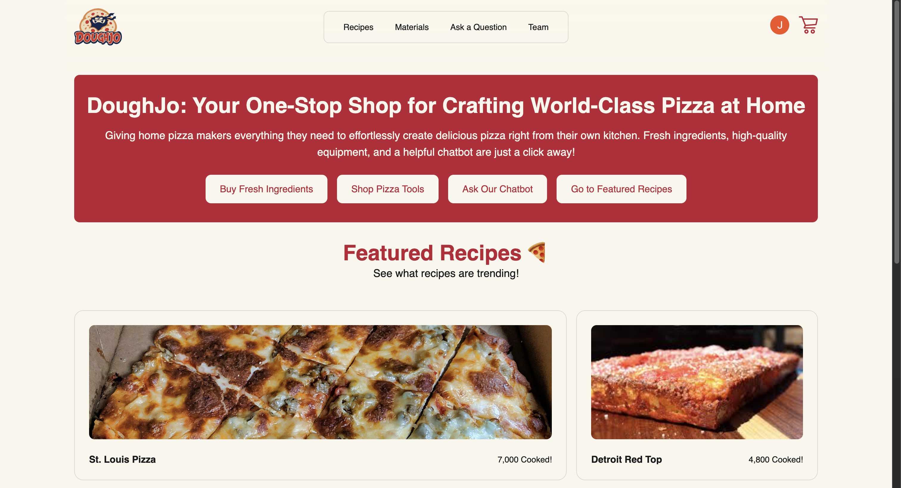

# DoughJo: Your One-Stop Shop for Crafting World-Class Pizza at Home

## Project Overview
Tired of mediocre pizza? **Perfect the art of homemade pizza** with **DoughJo**, your all-in-one web app for crafting pizzeria-quality pies with ease. No more guesswork—just perfect, homemade pizza every time. 
- **Curated Recipes & Tools** – Easily access delicious recipes, vetted - equipment, and consolidated ingredient lists
- **Effortless Shopping** – Find and purchase the best tools and ingredients with just a few clicks
- **Step-by-Step Mastery** – Learn foolproof techniques to stretch, top, and bake like a pro

## Application Link
Visit DoughJo at [pizza-app-394.web.app](https://pizza-app-394.web.app/). 

In order to be able to view and buy fresh ingredients or pizza-making equipment, you'll need to log in with Google using the "Sign In" button in the top left corner of our website. Otherwise, all other site features are available even without log in.

## Project Management
Click [here](https://github.com/orgs/NU394-s2025TTh/projects/6/views/1) to access our project backlog. The backlog is split into 2 different boards, the ["User Story Backlog"](https://github.com/orgs/NU394-s2025TTh/projects/6/views/1) and the ["Task Backlog"](https://github.com/orgs/NU394-s2025TTh/projects/6/views/7). 

The User Story backlog contains user scenarios and stories as issues. Issues for scenarios have their corresponding stories listed as sub-issues. Issues for stories display a prime number representing the size of the story.   

The Task backlog contains any technical work items completed by team members and identifies the primary tribe member who was responsible for implementing that work item. Any non-technical work items (such as client communication, product research, UI design, etc.) were instead communicated between tribe members and in written tribe meeting notes. See the subheading 'Additional Information and Documentation' below for where to find these meeting notes. 

## Build & Deployment
[DELETE THIS PARAGRAPH OF INSTRUCTIONS AFTER COMPLETION: Clearly outline the steps needed to build and deploy the application. This should cover any prerequisites, software dependencies, and a step-by-step guide to getting the application up and running on a new environment.]

### Prerequisites
[TODO BY ANTHONY]

### Software Dependencies 
[TODO BY ANTHONY]

### Step-by-Step Guide to Getting the Application Running on a New Environment
[TODO BY ANTHONY]

### How to Build the Application
[TODO BY ANTHONY]

### How to Deploy the Application
[TODO BY ANTHONY]

## Additional Information and Documentation
You can learn more about the behind-the-scenes design and development process of DoughJo throughout the following documentation found in this repository:

[Documentation Overview](docs/Home.md)\
[Architecture Overview](docs/Architecture-Overview.md)\
[Organizational Practices](docs/Organizational-Practices.md)\
[Development Practices](docs/Development-Practices.md)\
[Client Information](docs/Client-Information.md)\
[Backlog](docs/Backlog.md)\

You can access our day-to-day meeting notes and documents at the following Google Drive links:

[Tribe Google Drive Folder](https://drive.google.com/drive/folders/1_gJ4Z9EAXGhxvh53fvZtDEVC9etsvMdk?usp=sharing)
[Tribe Meeting Notes](https://docs.google.com/document/d/1Uqcr_zaJSmKHLNT8eJ4DopKrVTxgoCXqTyZuMeAjSwU/edit?tab=t.0#heading=h.l8i64pgdxonv)
[Client Meeting Notes](https://drive.google.com/drive/folders/1ECqC5RHikWsLMxAY9um4lr84YafrYQIv?usp=drive_link)

## Acknowledgements
Big thanks to:
- Our teaching staff, Prof. Todd Warren and TA Paula Kayongo, for their constant guidance and support
- Our clients, Bob Rapp and Ian Gibbs, for their great communication and mentorship

## Attribution
Two teams, Team Green and Team Purple, worked together as a tribe to develop this project. 

### Product Owners
| Team   | Name           |
| ------ | -------------- |
| Purple | Eric Polanski  |
| Green  | Joanna Soltys  |

### Architects
| Team   | Name           |
| ------ | -------------- |
| Purple | Ashwin Baluja  |
| Green  | Anthony Behery |

### Developers

| Team   | Name           |
| ------ | -------------- |
| Green  | Ludi Yu        |
| Purple | Aanand Patel   |
| Purple | Laura Felix    |
| Green  | David Park     |
| Green  | Aidan Goodrow  |
