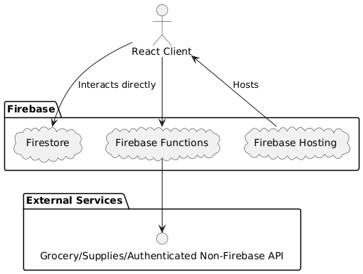

<!--
@startuml
actor Client [
  React Client
]

package "Firebase" {
  cloud Firestore
  cloud "Firebase Functions" as Functions
  cloud "Firebase Hosting" as Hosting

}

package "External Services" {
  interface "Grocery/Supplies/Authenticated Non-Firebase API" as ExternalAPI
}

Client -r-> Firestore : Interacts directly
Client -d-> Functions
Functions -d-> ExternalAPI
Hosting -u-> Client : Hosts
@enduml
-->

